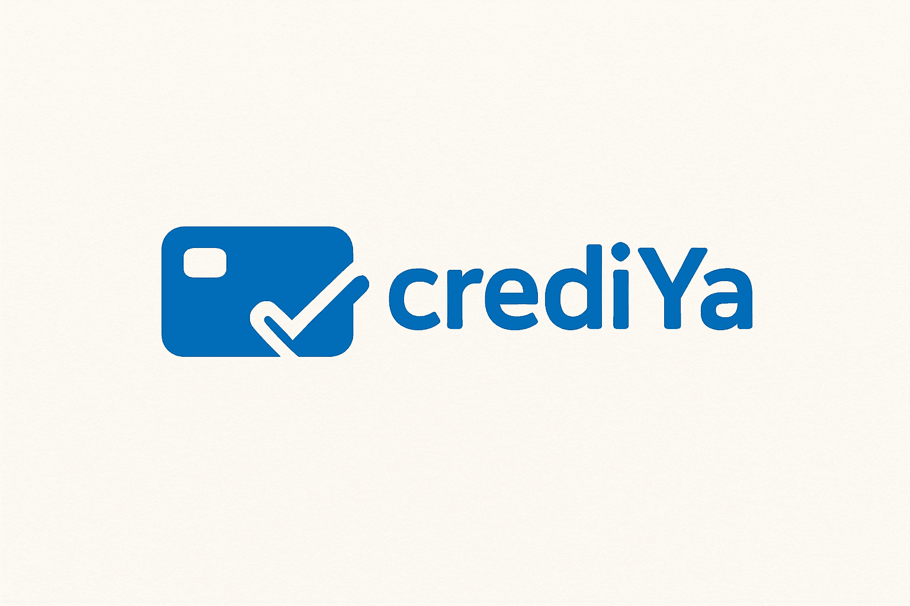
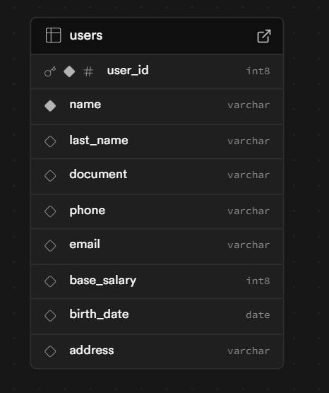

# CrediYa - crediya-authentication-service

Este microservicio está diseñado para gestionar usuarios dentro del sistema CreiYa, siguiendo principios de arquitectura hexagonal, desarrollado con WebFlux para un enfoque reactivo y eficiente en la gestión de solicitudes concurrentes.

Cada microservicio en el ecosistema de CreiYa se mantiene en un repositorio y base de datos independiente, asegurando modularidad y escalabilidad.

# Tecnologías utilizadas

- Java 17 / Spring Boot WebFlux – Desarrollo reactivo y no bloqueante.
- Arquitectura Hexagonal (scaffold) – Separación clara entre dominio, aplicación e infraestructura.
- Gradle – Gestión de dependencias y construcción del proyecto.
- PostgreSQL – Base de datos relacional robusta y escalable.
- Spring Data R2DBC – Acceso reactivo a bases de datos SQL.
- Swagger / OpenAPI – Documentación de API interactiva.
- SonarLint – Validación de calidad de código en tiempo de desarrollo.
- JUnit + Mockito / Test unitarios – Validación de lógica de negocio.
- Logs de traza y manejo de excepciones – Para monitoreo y control de errores.

# Arquitectura
Para este proyecto se ha utilizado una clean architecture  (utilizando el pluggin de bancolombia scaffold), que se compone de las siguientes capas: .-

- Domain 
- Infrastructure 
- Application

Este módulo es el más externo de la arquitectura, es el encargado de ensamblar los distintos módulos, resolver las dependencias y crear los beans de los casos de use (UseCases) de forma automática, inyectando en éstos instancias concretas de las dependencias declaradas. Además inicia la aplicación (es el único módulo del proyecto donde encontraremos la función “public static void main(String[] args)”.

# Base de datos 

Para la base de datos se utiliza PostgreSQL en Supabase, y se gestiona a través de R2DBC para mantener el enfoque reactivo en todas las capas del microservicio. La configuración de la conexión a la base de datos se encuentra en el archivo `application.yml`, donde se especifican los detalles necesarios para establecer la conexión.

